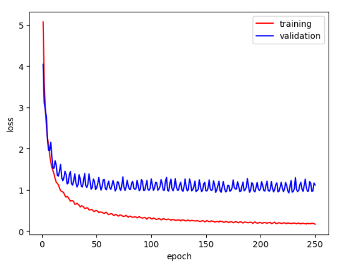

# version

## 1

```python
class Config:
    # data path
    data_path = './Dataset/'
    metadata_path = './Dataset/metadata.json'
    mapping_path = './Dataset/mapping.json'
    testdata_path = './Dataset/testdata.json'

    # local or cloud
    if 'kaggle/working' in os.getcwd(): 
        at_cloud = True
        data_path = '/kaggle/input/ml2022spring-hw4/Dataset/'
        metadata_path = data_path + 'metadata.json'
        mapping_path =  data_path + 'mapping.json'
        testdata_path = data_path + 'testdata.json'
    else:
        at_cloud = False

    # environment
    device = 'cuda' if torch.cuda.is_available() else 'cpu'   # 类变量
    seed = 923
    model_save_path = './model.ckpt'

    # NN structure
    input_dim = 40
    output_dim = 600
    transfomer_d_model = 80

    # training
    n_example = 56666
    n_epoch = 700
    segment_len = 80
    validation_ratio = 0.2
    batch_size = 64
    initial_lr = 1e-4
    warmup_steps = n_epoch // 100
    n_worker = 0

    # runing_test
    runing_test = False   # need be modified by hand
    if runing_test:
        n_example = 2000
        n_epoch = 4

    if at_cloud:
        n_worker = 8
```

- best validation acc = 0.6544
- Kaggle private score: 0.40125


分析

- 训练和验证的 loss 都降不下去了，可能是模型能力不足。

## 2

策略：

- 加一层 encoder 。

```python
optimizer 的参数换为默认的 lr = 1e-3
num_layers=2
```

想法：

- 加 softmax ？

	pytorch 的 cross entropy 自带 softmax 。

结果：

- best training loss = 0.7511, best validation loss = 1.2382, best acc = 0.7335
- kaggle private score: 0.45275


分析：

- score 稍有提升，但比验证 acc 低很多，可能是泛化不够。
- loss 不再降低，说明模型拟合能力还不够。

## 3

策略：

- 加 encoder 的 dropout 。
- 再加一层 encoder layer 。

```python
encoder_layer: droput = 0.3   # 默认为 0.1
num_layers=3
```

想法：

- 加 nhead ？参见 7 。

结果：

- best training loss = 0.7570, best validation loss = 1.2828, best acc = 0.7437
- kaggle private score = 0.45925


分析：

- loss 还是降不下来，可能过拟合。

## 4

取消。

## 5

策略：

- 改回 encoder layer 。
- 提升 droput 。

```python
encoder_layer: droput = 0.5
num_layers = 2
```

结果：

- best training loss = 1.0383, best validation loss = 1.5979, best acc = 0.6966
- kaggle private score = 0.41975


分析：

- loss 一直降不下来，是模型复杂度不够。

## 6

策略：

- 加头。
- 加层。
- 保持 dropout 。

```pyton
encoder_layer: droput = 0.5
num_layers = 4
nhead = 8
```

结果：

- best training loss = 0.8140, best validation loss = 1.4555, best acc = 0.7271
- kaggle private score = 0.4415


分析：见 7

## 7

策略：

- 与 3 进行对比，加头的作用。

```python
encoder_layer: droput = 0.3
num_layers = 3
nhead = 8
```

结果：

- best training loss = 0.7114, best validation loss = 1.2363, best acc = 0.7525
- kaggle private score = 0.448


分析：

- 6 加层，7 加头都没有显著作用。
- dropout 也没有显著作用。

## 8

恢复到验证 acc 和 score 都较高的 version 2 。

策略：

- loss 震荡，加正则。

```python
num_layers = 2
dropout = 0.1   # 默认 0.1
nhead = 2

weight_decay = 1e-2
```

- 错误，傻逼，weight_decay 默认值就是 1e-2 。

取消。

## 9

重开 8 。

```python
weight_decay = 1
```

结果：

- best training loss = 4.2552, best validation loss = 4.1205, best acc = 0.1755


分析：

- 正则过强。

## 10

在 version 2 的基础上。

错误：

- d_model 和 segment_len 意义应当不同。
	- d_model 为单个特征向量输入长度。
	- segment_len 我特征向量序列长度。

策略：

- 加段长度。

```
segment_len = 128
d_model = 80   # 保持不变
```

想法：

- 加大 d_model 。？参见 11，12 。

结果：

- best training loss = 0.3704, best validation loss = 0.9776, best acc = 0.8006
- kaggle private score = 0.52225


分析：

- 提升段长有效果。

## 11

策略：

- 继续提升段长。
- 提升 `d_model`

```python
segment_len = 160
d_model = 128
```

结果：

- best training loss = 0.1644, best validation loss = 0.9245, best acc = 0.8354
- kaggle private score = 0.542




分析：

- 11 与 12 的 acc 相差不多，在 11 的基础上，主要是泛化性问题。

## 12

策略：

- 大段长。

```python
segment_len = 256
d_model = 128
```

结果：

- best training loss = 0.0729, best validation loss = 0.8710, best acc = 0.8594
- kaggle private score = 0.58225


## 13

策略：

- 在 11 基础上，提升 droput 。

```python
dropout = 0.3
nhead = 8
```

结果：

- best training loss = 0.1678, best validation loss = 1.0096, best acc = 0.8344
- kaggle private score = 0.53525


## 14

策略：

- 在 13 基础上，加层。

```python
num_layer = 3
```

结果：

- best training loss = 0.1553, best validation loss = 0.9137, best acc = 0.8465
- kaggle private score = 0.5685


## 15

策略：

```python
segment_len = 256
d_model = 160
droput = 0.1
num_layer = 3
weight_day = 1e-1
nhead = 8
```

结果：

- best training loss = 0.1502, best validation loss = 0.4625, best acc = 0.8959
- kaggle private score = 0.6895


分析：

- 主要因素在 `segment_len ` 和 `d_model ` 上 。`d_model` 和 output 的维数不要相差太大。

## 16

策略：

- 在 15 基础上，修改预测方式，切 5 次 segment_len ，综合分段结果。

```python
segment_len = 256
d_model = 160
droput = 0.1
num_layer = 3
weight_day = 1e-1
nhead = 8
```

结果：

- best training loss = 0.1343, best validation loss = 0.4543, best acc = 0.8985
- kaggle private score = 0.7245


## 想法

